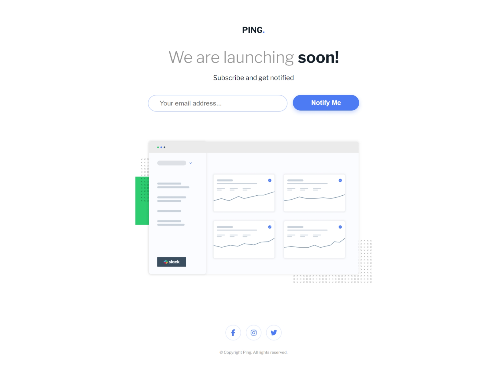

# Frontend Mentor - Ping Coming Soon Page Solution

This is my solution to the [Ping Coming Soon Page challenge on Frontend Mentor](https://www.frontendmentor.io/challenges/ping-single-column-coming-soon-page-5cadd051fec04111f7b848da). This project helped me improve my HTML, CSS, and JavaScript skills by building a real-world, responsive design.

## Table of contents

- [Frontend Mentor - Ping Coming Soon Page Solution](#frontend-mentor---ping-coming-soon-page-solution)
	- [Table of contents](#table-of-contents)
	- [Overview](#overview)
		- [The challenge](#the-challenge)
		- [Screenshot](#screenshot)
		- [Links](#links)
	- [My process](#my-process)
		- [Built with](#built-with)
		- [What I learned](#what-i-learned)
		- [Useful resources](#useful-resources)
	- [Author](#author)
	- [Acknowledgments](#acknowledgments)

## Overview

### The challenge

Users should be able to:

- View the optimal layout for the site depending on their device's screen size.
- See hover states for all interactive elements on the page.
- Submit their email address using an input field.
- Receive error messages

### Screenshot



### Links

- [Solution URL](https://github.com/fawaziwalewa/ping-coming-soon-page)
- [Live Site URL](https://fawaziwalewa.github.io/ping-coming-soon-page/)

## My process

### Built with

- Semantic HTML5
- CSS custom properties
- Flexbox
- Mobile-first workflow
- JavaScript for form validation

### What I learned

Through this challenge, I improved my skills in:

- Using media queries for responsive design.
- Writing form validation logic in JavaScript.
- Creating visually appealing hover and focus states for buttons and inputs.

Here's an example of the form validation logic I wrote:

```js
function isInvalidEmail(email) {
  const emailRegex = /^[^\s@]+@[^\s@]+\.[^\s@]+$/;
  return !emailRegex.test(email); // Returns true if invalid
}
```

### Useful resources

- [MDN Web Docs - Form Validation](https://developer.mozilla.org/en-US/docs/Learn/Forms/Form_validation) - This guide helped me understand how to implement custom validation logic.
- [CSS Tricks - A Complete Guide to Flexbox](https://css-tricks.com/snippets/css/a-guide-to-flexbox/) - Flexbox was used to align and distribute elements effectively.

## Author

- Website - [Iwalewa Fawaz](https://iwaola.me)
- Frontend Mentor - [@IwalewaFawaz](https://www.frontendmentor.io/profile/IwalewaFawaz)
- Twitter - [@IwalewaFawaz](https://twitter.com/IwalewaFawaz)

## Acknowledgments

Special thanks to Frontend Mentor for providing this challenge and to all the resources that helped me complete this project!
